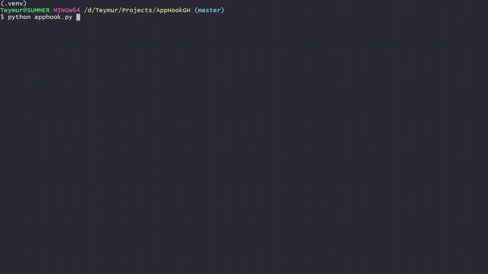

# AppHook
Tool for managing Java application instances which deployed using AppRoll.

* Developed and tested with:
    - Python 3.6

## Features:
* Choose multiple Applications, Environments and Sites at once
* Manage systemd service (start,stop,restart,is-active)
* Healthcheck via HTTP
* Get current version of Application
* Logging to Syslog
* Prevent multiple instance run at same time

## Requirements:
* User with key authentication and restricted sudo privileges (Currently: /bin/systemctl,/bin/tail) on application servers.
* Access to [AppRoll](https://github.com/teymurgahramanov/AppRoll) repository
* User which will use AppHook must have rw privileges, to be able to clone AppRoll repository.
* Your ```vars.yml``` in AppRoll must have correct structure and actual data
 
## How to use
1. Create virtual environment and install required modules
2. Place user key in ./ssh
3. Configure ./apphook.yml
4. (Recommended) Set alias: \
```alias apphook="clear; /path/apphook/.venv/bin/python /path/apphook/apphook.py"```
5. Start and follow instructions ```¯\_(ツ)_/¯``` (May take some time until clone AppRoll)


